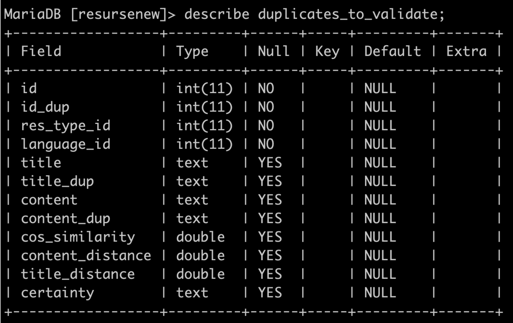

 # Identifying Duplicates 

 This folder focuses on identifying duplicates in text based data such as lyrics and poems. Duplicate resources are largely identified based on [cosine similarity](https://en.wikipedia.org/wiki/Cosine_similarity) and identified based on the vocabularily of the same resource type and language.

**Assumptions**
- assumes that duplicates are desired to be found for text resources that have been uploaded on the website in the last {x} hours 
- assumes that older duplicates have been dealt with before as one off duplicate reduction. One instance was done before and saved in this [commit](https://github.com/ppetruneac/rc-text-recommender/commit/8b6eb85375eb416a46364ae8e8575ea6a19bc6fc) and saved as `data/all_duplicates.csv` file
- focuses on resources of type *str* and only for resource types with at least {x} number of observation by language, configured in `config.yaml` as *min_obs_lan* 

The above {parameters} can be defined in [config.yaml](./config.yaml). 

 ## Data

 Data came in *.sql* format and it was an extraction of the actual MySQL database. The file was imported in MySQL Workbench locally in *resursenew* database. The tables are: `resources`, `res_type` and `text_details`. 

 Plese refer to [data/data_overview.ipynb](data/data_overview.ipynb) for details on the exact fields in the raw dataset. 

 ## Instructions on set up 
 - run (ONLY for the first time): `bash initialisation_mysql.sh  -u <USER> -p <PASSWORD>` to create some MySQL tables and load some data in (i.e. `duplicates_validated` in `duplicates_to_validate` table). You may need to change the root in [line #31](https://github.com/ppetruneac/rc-text-recommender/blob/b0273bac6df4f255b7094ea19d9c4d8fe1dd928f/detect_duplicates/initialisation_mysql.sh#L31)
 - run `bash requirements.sh` to install dependancies from fresh in CentOS. This installs Python + dependant packages. 
 

## Files
- [config.yaml](config.yaml): config file
- [utils.py](utils.py): utility functions
- [detect_duplicates.py](detect_duplicates.py): core code for detecting duplicates
- [main_detect_duplicates.py](main_detect_duplicates.py) -- main function to run on terminal. This will save the duplicates data in the data/interim folder in *csv* format. 
- [main_detect_duplicates.sh](main_detect_duplicates.sh): main file to run on bash. It runs [main_detect_duplicates.py](main_detect_duplicates.py) and then it loads the results into MySQL. 
 
 
 
 ## How to run
 ```
 bash main_duplicates.sh -u <USER> -p <PASSWORD>
 ```
 
 ## Detecting duplicates
 A few more notes for explaining how the duplicates are detected and notes on post processing. 

- Pentru fiecare resursa se identifica cea mai apropiata resursa dublura pentru acelasi tip de resursa (e.g. cantare) si limba (e.g. ro, en) bazat pe `cos_similarity` (o diferenta de apropiere intre resurse bazata pe toate cuvintele din resursa)
- Alti indici de comparatie: 
  - `content_distance`: o similaritate intre primele 100 de caractere ale celor doua resurse - cea penrtru care se cauta o dublura si cea mai apropiata dublura. 
  - `title_distance`: o similaritate intre titlul celor doua resurse - cea penrtru care se cauta o dublura si cea mai apropiata dublura. 
> Toti acesti indici (cos_similarity, content_distance, title_distance) sunt folositi pentru a popula campul `certainty`.
  - By default ia valoarea: 'unknown'
  - Daca a fost validata manual de user: `validated`
  - Pentru a schimba campul, se folosesc indici din `duplicates_validated` table. 
  - Pentru aceelasi tip de resursa si limba: 
    - certainty → `likely`: daca cel putin doi dintre cei 3 indici au valoare > decat valoarea maxima a indicelui in  `duplicates_validated` - (minus) standard deviation. 
    - certainty → `unlikely`: daca cel putin doi dintre cei 3 indici au valoare > decat valoarea minima a indicelui in  `duplicates_validated` - (minus) standard deviation. 

Here is an image with the final schema: 

